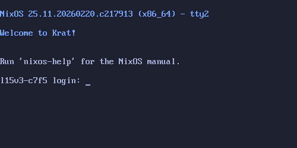

# Greeters

A list of known zgsld greeters to choose from. 

If you find something that isn't listed, open an issue or a pull request! 

## zgsld-agetty

[https://github.com/ashametrine/zgsld-agetty](https://github.com/ashametrine/zgsld-agetty)

A small and simple terminal greeter for zgsld that mirrors the familiar `agetty` and `/bin/login` flow, but with support for starting a wider range of sessions, including Wayland and X11 sessions.

## zgsld-greetd-bridge

[https://github.com/ashametrine/zgsld-greetd-bridge](https://github.com/ashametrine/zgsld-greetd-bridge)

A compatibility bridge to make [Greetd](https://sr.ht/~kennylevinsen/greetd/) greeters compatible with ZGSLD.
